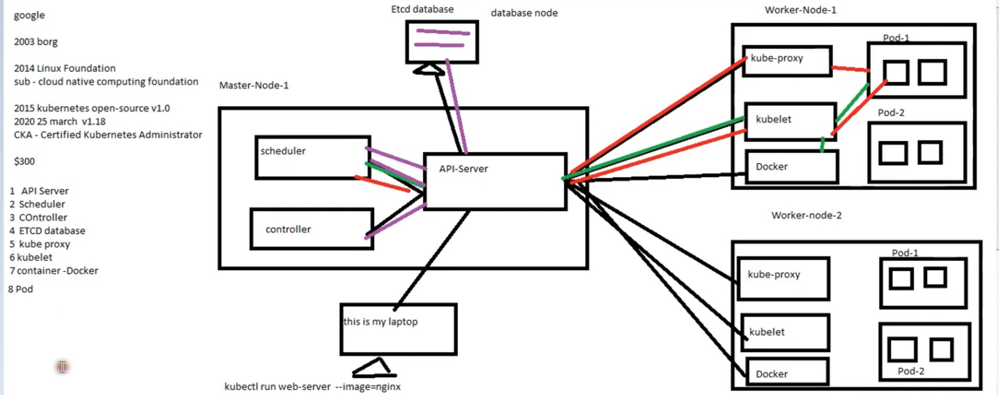
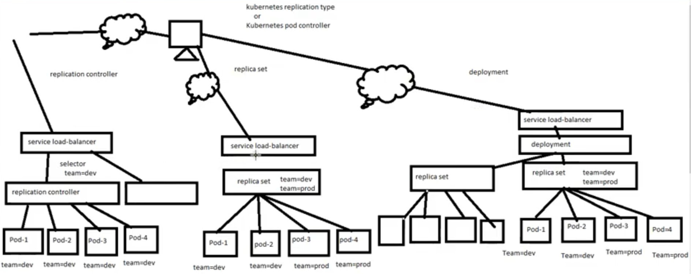

- [## Introduction](#-introduction)
- [### Architecture](#-architecture)
  - [Kubernities Components:](#kubernities-components)
    - [Api Server:-](#api-server-)
    - [Scheduler](#scheduler)
    - [Controller:-](#controller-)
    - [ECTD Database:-](#ectd-database-)
    - [Kube Proxy:-](#kube-proxy-)
    - [Kubelet:-](#kubelet-)
    - [Container Docker:-](#container-docker-)
    - [POD:-](#pod-)
  - 
  - [Cluster Steup](#cluster-steup)
- [- Platform as Service](#--platform-as-service)
  - [You can create cluster following methods](#you-can-create-cluster-following-methods)
  - [Cloud Services that support kubernities](#cloud-services-that-support-kubernities)
  - [Kubernities replication](#kubernities-replication)
- [References:](#references)

## Introduction
----

Kubernetes, also known as K8s, is an open source system for managing [containerized applications]
across multiple hosts. It provides basic mechanisms for deployment, maintenance,
and scaling of applications.

Kubernetes builds upon a decade and a half of experience at Google running
production workloads at scale using a system called [Borg],
combined with best-of-breed ideas and practices from the community.

Kubernetes is hosted by the Cloud Native Computing Foundation ([CNCF]).
If your company wants to help shape the evolution of
technologies that are container-packaged, dynamically scheduled,
and microservices-oriented, consider joining the CNCF.
For details about who's involved and how Kubernetes plays a role,
read the CNCF [announcement].
  

### Architecture
----
Deploying an application to Kubernetes means deploying an application to a Kubernetes cluster.

A typical Kubernetes cluster is a collection of physical or virtual machines called nodes that run containerized applications. A cluster is made up of one master node that manages the cluster, and many worker nodes that run the actual application instances inside Kubernetes objects called pods.

A pod is a basic building block in a Kubernetes cluster. It represents a single running process that encapsulates a container or in some scenarios many closely coupled containers. Pods can be replicated to scale applications and handle more traffic. From the perspective of a cluster, a set of replicated pods is still one application instance, although it might be made up of dozens of instances of itself. A single pod or a group of replicated pods are managed by Kubernetes objects called controllers. A controller handles replication, self-healing, rollout of updates, and general management of pods. One example of a controller that you will use in this guide is a deployment.

A pod or a group of replicated pods are abstracted through Kubernetes objects called services that define a set of rules by which the pods can be accessed. In a basic scenario, a Kubernetes service exposes a node port that can be used together with the cluster IP address to access the pods encapsulated by the service.

To learn about the various Kubernetes resources that you can configure, see the <a href="https://kubernetes.io/docs/concepts/" target="_blank"> official Kubernetes documentation.</a>

----

### Kubernities Components:

#### Api Server:-
APi Server is working like as middleware, In kubernities every component is communicate through api server they are communication personally   

#### Scheduler
Schdular basically are responsable to which node is perfect to deploy and run POD. Schedular will run when it's got the instruction from the api server given  by kubernities adminstator 

#### Controller:- 
Controller basically are responsable to maintain the POD up and live, in case pod are deleted then controller responsbility to create again them.  

#### ECTD Database:- 
Schdular basically are responsable to which node is perfect to deploy and run POD. Schedular will run when it's got the instruction from the api server given  by kubernities adminstator  

#### Kube Proxy:- 
Kube Proxy is to make networking for the POD, means kubeproxy give an IP to Every POD at the time POD creation. 
 

####  Kubelet:- 
The kubelet is responsible for maintaining a set of pods, which are composed of one or more containers, on a local system. Within a Kubernetes cluster, the kubelet functions as a local agent that watches for pod specs via the Kubernetes API server.
 

####  Container Docker:-
Container is responsable download the image inside the POD from the docker registery and other source.  
 

####   POD:-
A Kubernetes pod is a collection of one or more Linux® containers, and is the smallest unit of a Kubernetes application. Any given pod can be composed of multiple, tightly coupled containers (an advanced use case) or just a single container (a more common use case). Containers are grouped into Kubernetes pods in order to increase the intelligence of resource sharing, as described below.
 

### 
 
 
 
 
Component Communication workflow
 

### Cluster Steup
By using kubernities you can setup Cluster on the follwoing place
- On Primises
- Cloud- AWS/GCP/Azure
- VM
- Platform as Service
----

### You can create cluster following methods
- Using Kubeadm
- Using file methods
- Using Kubeadm
- Using Minikube (Only for learning purpose, its make single node cluster not recommended for production)
- Using Kops (Basically it's kubernities tools that is also supporterd by AWS, Google, Terraform, VMware)

### Cloud Services that support kubernities

- Google (GKE)
- Azure (AKS)
- AWS (EKS)
- Readhat (Open shift)

 

### Kubernities replication
There are three type of kubernities replication
-   Relication Controller
-   Replica Set
-   Deployment

<b>Relication Controller</b> can create number of pods and manage the 24/7 them if any thing happen wrong inside the pod or pod is deleted in that case pod automatically create by using replication controller. 
It has the feature of autoscaling. This replication controller will handle only single label type pf pods. It's not capabale to handle different type of label pods.
In replication contoller has Rolling update feature.
It has a downtime at the time of roling update because it will shift all the pods from the one replication to another replication, see in the picture.

At the time create the POD we've to set label for that POD and in replication controller we have to ask that you will handle only those pods which label is team=dev and it will not consider other label pods.

<b>Replica set</b> is almost same as replication contoller but they have power to handle diffreent type label pods. It's also work like autoscaling and in replica set don't have Rolling update feature
For Example Replica set can handle the team=dev and team=prod.

<b>Deployment</b> is the most powerfull controller because they have feature roling update and rolout both feature along with they have the multiple lable type pod handler feature.
It has less downtime because it will create new replica set at the pallerel of exist replica set and it copy the pods from one replica to another not move.
if you need to rolout the you can easily rolout because it's not remove previous replica set.
See in the picture given below.
 

 
 
 
Kubernities Replica Controller Workflow
 

----
## References:

[Megalix Blog](https://www.magalix.com/blog/the-best-kubernetes-tutorials)

[IBM Devlopers](https://developer.ibm.com/series/kubernetes-learning-path/)
