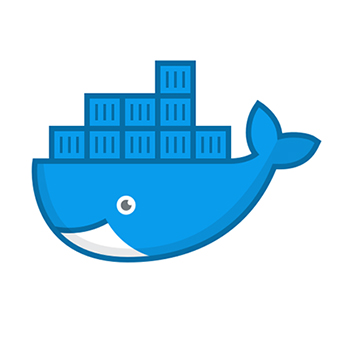
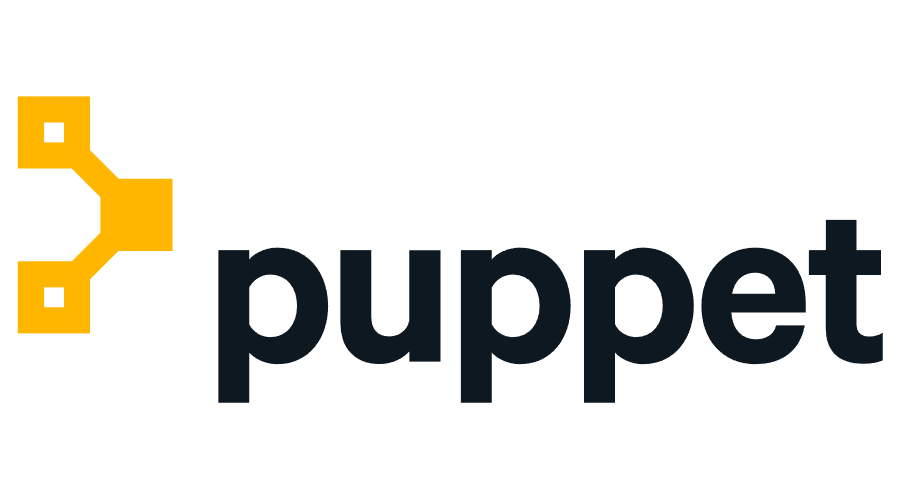

<!-- 

		<a href="https://triplebyte.com/a/UEmYALe/d">
		<b>Looking for a job?</b> 
			 
			No resume needed. Just prove you can code. Take Triplebyte’s quiz 
      and go straight to final onsite interviews!
			 
			

				
			

		</a>
	

	

	 -->
	
*******************

### In DevOps You should have knowldege of following tools and technologies

<table>
 <tr>
  <td align="center"><a href="./OS"> <b>Linux</b></a></td>

<td align="center"><a href="./Networking"> <b>AWS</b></td>

  <td align="center"><a href="./Container-orchestration/Docker"> <b>Docker</b></a>
  </td>

  <td align="center"><a href="./Container-orchestration/kubernetes"> <b>Kubernetes</b></a></td>

  <td align="center"><a href="./CI-CD/git"> <b>Git</b></a> </td>

  <td align="center"><a href="./Infrastructure-provisioning/Terraform"> <b>Terraform </b></a></td>

  <td align="center"><a href="./CI-CD/jenkins"> <b>Jenkins</b></a></td>

  <td align="center"><a href="./OS"> <b>Linux</b></a></td>

  <td align="center"><a href="./Networking"> <b>Networking</b></a></td>

     
</tr>
   
   
 </table>
   
<table>

<tr>  
  <td align="center"><a href="./Infrastructure-provisioning/Ansible"> <b>Ansible</b></a></td>

  <td align="center"><a href="./CI-CD/GitlabCi"> <b>GCP</b></a></td>

  <td align="center"><a href="./Infrastructure-provisioning/Puppet"> <b>Puppet</b></a></td>

  <td align="center"><a href="./Infrastructure-provisioning/Chef"> <b>Chef</b></a> </td>

</tr>
  
 </table>

********************

### 0.2. Getting Started DevOps Links:

- [What is Devops - AWS](https://aws.amazon.com/devops/what-is-devops/)
- [What is DevOps - Logit.io](https://logit.io/blog/post/what-is-devops)

  
**************************

## 1. Contributors ✨

Thanks goes to these wonderful people ([emoji key](https://allcontributors.org/docs/en/emoji-key)):

<!-- ALL-CONTRIBUTORS-LIST:START - Do not remove or modify this section -->
<!-- prettier-ignore-start -->
<!-- markdownlint-disable -->
<table>
  <tr>
    <td align="center"><a href="javascript:;"> <b>Shailendra Dubey</b></a> <a href="https://github.com/Tikam02/DevOps-Guide/commits?author=neilduncan" title="Documentation">📖</a></td>
    <td align="center"><a href="javascript:;"> <b>Nikita Sharma</b></a> <a href="https://github.com/Tikam02/DevOps-Guide/commits?author=neilduncan" title="Documentation">📖</a></td>
      </tr>
</table>

<!-- markdownlint-enable -->
<!-- prettier-ignore-end -->
<!-- ALL-CONTRIBUTORS-LIST:END -->

This project follows the [all-contributors](https://github.com/all-contributors/all-contributors) specification. Contributions of any kind welcome!

********************************************

*********************************************
## 2. License

This project is licensed under the MIT License - Copyright (c) 2019
